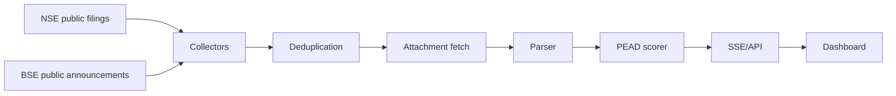

# PEAD Capture

Low-latency earnings-results capture for Indian equities using free public NSE/BSE corporate filing endpoints.

## Local Setup

```bash
npm install
python3 -m pip install -r requirements.txt
cp .env.example .env
npm run dev
```

Open `http://localhost:4173`.

## Modes

- `COLLECTOR_MODE=live` polls public NSE/BSE announcement endpoints. This is the default.

## Environment

```bash
PORT=4173
POLL_INTERVAL_MS=6000
HOT_POLL_INTERVAL_MS=3000
COLLECTOR_MODE=live
PROCESSING_CONCURRENCY=3
PARSER_TIMEOUT_MS=30000
WATCHLIST=
PYTHON_PATH=python3
NSE_ANNOUNCEMENTS_URL=https://www.nseindia.com/api/corporate-announcements?index=equities
BSE_ANNOUNCEMENTS_URL=https://api.bseindia.com/BseIndiaAPI/api/AnnGetData/w?strCat=-1&strPrevDate=&strScrip=&strSearch=P&strToDate=&strType=C
AI_PROVIDER=disabled
AI_API_KEY=
AI_MODEL=
AI_EXTRACTION_MODE=disabled
```

### AI-assisted extraction

The parser can use Gemini, OpenAI, or Claude as a second extraction pass while keeping the same dashboard data model.

```bash
AI_PROVIDER=gemini        # gemini, openai, anthropic, claude, disabled
AI_API_KEY=               # provider key
AI_MODEL=                 # optional; provider default is used when blank
AI_EXTRACTION_MODE=always # always, fallback, disabled
AI_MAX_PAGES=4
AI_MAX_CHARS_PER_PAGE=3600
AI_TIMEOUT_MS=18000
AI_MIN_LOCAL_CONFIDENCE=0.82
AI_CONCURRENCY=1
AI_RATE_LIMIT_COOLDOWN_MS=45000
AI_REQUIRE_SUCCESS=false
```

Cost control is handled by the local parser first selecting compact candidate financial pages from the PDF. The AI provider receives only those page snippets plus local extraction hints, not the full PDF. Results are cached by PDF/input hash during the process lifetime.
When `AI_REQUIRE_SUCCESS=false`, filings still produce dashboard cards if the AI provider is rate-limited; those cards are labelled with the AI error state so they are not mistaken for AI-verified figures.

## Scripts

```bash
npm run dev      # local development
npm start        # production server
npm run lint     # syntax checks for Node and Python files
```

## Architecture



## Production Notes

- NSE and BSE portal URLs are configured in `.env` so they can be changed without code edits.
- NSE/BSE polling is implemented in Python through `apps/backend/python/polling_service.py`.
- PDF fetching and financial metric extraction is implemented in Python through `apps/backend/python/parser_service.py`.
- Public endpoints may throttle, change shape, or reject traffic. The Python services are isolated so hardened fetch/session logic can be swapped in without touching the dashboard.
- The dashboard receives updates through Server-Sent Events, so it does not add repeated browser polling load.

## Deployment

### Long-running server

This is the recommended deployment style because the app continuously polls NSE/BSE and streams live events to the dashboard.

```bash
npm install --omit=dev
python3 -m pip install -r requirements.txt
cp .env.example .env
npm start
```

Make sure the host provides:

- Node.js 20+
- Python 3.10+
- outbound HTTPS access to NSE/BSE
- persistent process support

### Docker

```bash
docker build -t pead-capture .
docker run --env-file .env -p 4173:4173 pead-capture
```

### Render, Railway, Fly.io, VPS, EC2, DigitalOcean

Use `npm start` as the start command. Install Python dependencies from `requirements.txt`, or use the included `Dockerfile`.

### Vercel

Vercel is excellent for frontend and serverless APIs, but this app currently uses a long-running polling process plus Server-Sent Events. For Vercel, use one of these patterns:

- Deploy the dashboard/frontend on Vercel and run the polling API on a long-running host.
- Refactor the collector into Vercel Cron Jobs that write to a database, then let the dashboard read from that database.

See `deployment/vercel/README.md` for details.
